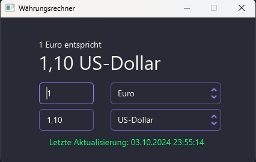

# **Currency Converter**

Ein einfacher Währungsumrechner, der aktuelle Wechselkurse verwendet, um Beträge zwischen verschiedenen Währungen umzurechnen.

## **Inhaltsverzeichnis**

- [Überblick](#überblick)
- [Funktionen](#funktionen)
- [Screenshots](#screenshots)
- [Installation](#installation)
- [Verwendung](#verwendung)
- [Architektur](#architektur)
- [Abhängigkeiten](#abhängigkeiten)
- [Lizenz](#lizenz)
- [Kontakt](#kontakt)

---

## **Überblick**

Der Currency Converter ist eine JavaFX-Anwendung, die es Benutzern ermöglicht, Beträge zwischen verschiedenen Währungen auf der Grundlage aktueller Wechselkurse umzuwandeln. Die Anwendung lädt die Wechselkurse von [FloatRates](https://www.floatrates.com) und speichert sie lokal, um eine schnelle und effiziente Umrechnung zu ermöglichen.

---

## **Funktionen**

- **Aktuelle Wechselkurse**: Lädt aktuelle Wechselkurse von [FloatRates](https://www.floatrates.com).
- **Unterstützung für über 150 Währungen**: Konvertiert Beträge zwischen einer Vielzahl von Währungen.
- **Automatische Aktualisierung**: Überprüft das Datum der Wechselkurse und aktualisiert sie bei Bedarf.
- **Benutzerfreundliche Oberfläche**: Intuitive UI mit Autovervollständigung für Währungen.
- **Dynamische Formatierung**: Formatiert die Ausgabe basierend auf der Größe des Ergebnisses.
- **Offline-Modus**: Verwendet lokal gespeicherte Daten, wenn keine Internetverbindung verfügbar ist.

---

## **Screenshots**




---

## **Installation**

### **Voraussetzungen**

- **Java Development Kit (JDK) 11** oder höher
- **Maven** zur Verwaltung der Abhängigkeiten und des Build-Prozesses

### **Schritte zur Installation**

1. **Repository klonen**

   ```bash
   git clone https://github.com/paweluks/currency-converter.git

2. **In das Projektverzeichnis wechseln**
    ```bash
    cd currency-converter

3. **Projekt bauen**
    ```bash
    mvn clean install

Dieser Befehl lädt alle notwendigen Abhängigkeiten herunter und erstellt die ausführbare JAR-Datei im target-Verzeichnis.

## **Verwendung**

### **Anwendung starten**

Nach erfolgreichem Build können Sie die Anwendung mit dem folgenden Befehl starten:
 
    java -jar target/currency-converter-1.0.jar

### **Schritte zur Verwendung der Anwendung**
1. **Währungen auswählen**
   - Wählen Sie die Quellwährung aus der ersten Dropdown-Liste.
   - Wählen Sie die Zielwährung aus der zweiten Dropdown-Liste.
   - Die Autovervollständigungsfunktion hilft Ihnen bei der schnellen Auswahl.

2. **Betrag eingeben**
    - Geben Sie den Betrag ein, den Sie umrechnen möchten, in das erste Textfeld.
    - Das zweite Textfeld zeigt den umgerechneten Betrag an.

3. **Ergebnis ansehen**
   - Die Labels über den Textfeldern zeigen eine kurze Zusammenfassung der Umrechnung.
   - Das Datum der letzten Aktualisierung der Wechselkurse wird unten angezeigt.

### **Hinweise**
   - Automatische Umrechnung: Die Umrechnung erfolgt automatisch, sobald Sie einen Betrag eingeben oder eine Währung auswählen.
   - Eingabeformat: Verwenden Sie ein Komma oder einen Punkt als Dezimaltrennzeichen.


## **Architektur**
**Die Anwendung folgt dem Model-View-Controller (MVC)-Muster:**
 - **Model** (CurrencyConverterModel)
    - Verwaltet die Geschäftslogik.
    - Lädt und speichert Wechselkursdaten.
    - Führt die Umrechnungen durch.

 - **View**
   - Definiert in der currency_converter.fxml-Datei.
   - Enthält die Benutzeroberfläche der Anwendung.
   
 - **Controller** (CurrencyConverterController)
   - Verbindet die View mit dem Model.
   - Verarbeitet Benutzereingaben und aktualisiert die UI-Komponenten.
   
## **Abhängigkeiten**
   Die Anwendung verwendet die folgenden Hauptabhängigkeiten:
- JavaFX: Für die Erstellung der Benutzeroberfläche.
- Gson: Zum Parsen und Verarbeiten von JSON-Daten.
- org.json: Für die Arbeit mit JSON-Objekten.
- JUnit 5: Für Unit-Tests (Version 1.1).
- TestFX: Für UI-Tests (Version 1.1).

Die vollständigen Abhängigkeiten finden Sie in der pom.xml-Datei.

## **Lizenz**
Dieses Projekt ist unter der MIT-Lizenz lizenziert. Weitere Informationen finden Sie in der [LICENSE](LICENSE.md)-Datei.

## **Kontakt**
- Autor: Pawel Sala
- E-Mail: [pawel.sala@web.de](mailto:pawel.sala@web.de)
- GitHub: https://github.com/PawelUKS
- Bei Fragen, Problemen oder Verbesserungsvorschlägen können Sie gerne Kontakt aufnehmen oder ein Issue im GitHub-Repository erstellen.

## **Zukünftige Arbeiten (Version 1.1)**
- Einführung des Single Responsibility Principle (SRP): Refaktorierung des Codes, um die Verantwortlichkeiten klar zu trennen.
- Unit-Tests mit JUnit: Hinzufügen von Tests für die Geschäftslogik.
- UI-Tests mit TestFX: Automatisierte Tests der Benutzeroberfläche.
- Erweiterte Fehlerbehandlung: Verbesserung der Robustheit der Anwendung.
- Dokumentation: Hinzufügen von Javadoc-Kommentaren und ausführlicherer Dokumentation.

## **Beiträge**
Beiträge sind willkommen! Wenn Sie Fehler finden oder neue Funktionen hinzufügen möchten:
1. Forken Sie das Repository.
2. Erstellen Sie einen neuen Branch für Ihre Änderungen.
3. Stellen Sie einen Pull-Request mit einer Beschreibung Ihrer Änderungen.

## **Danksagungen**
- FloatRates für die Bereitstellung der Wechselkursdaten.
- Open-Source-Community für die großartigen Tools und Bibliotheken.